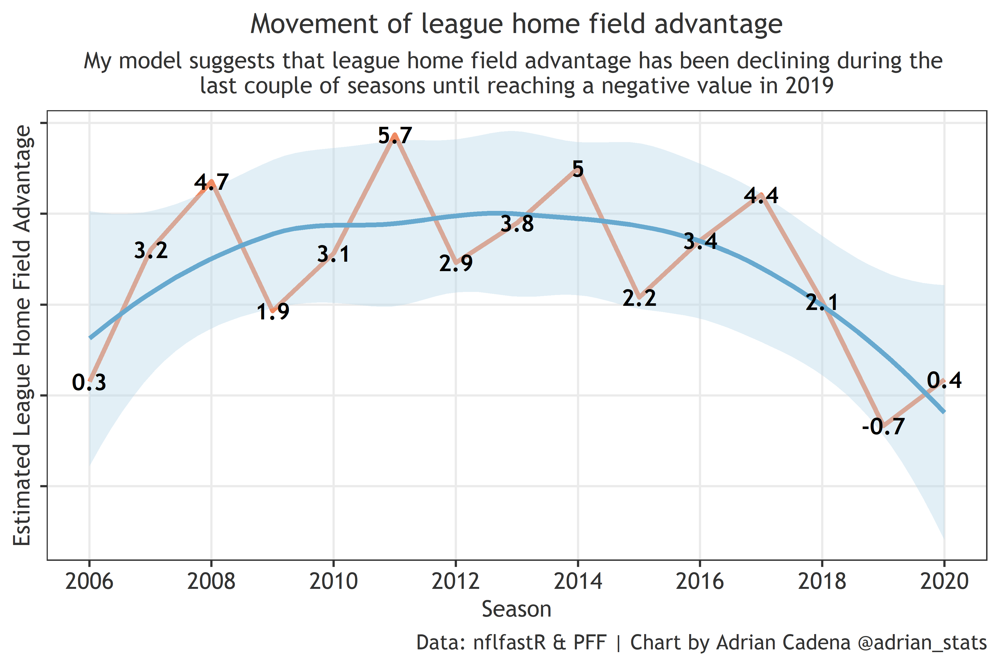
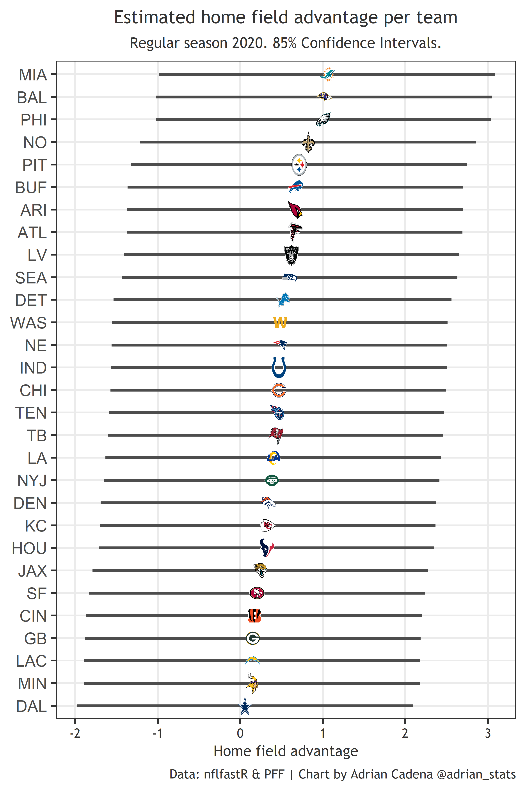

```{r setup, include=FALSE}
knitr::opts_chunk$set(
  echo = TRUE, 
  message = FALSE, 
  warning = FALSE, 
  dpi = 300, 
  tidy = 'styler'
  )
```

## Introduction
The sports betting industry and their enthusiasts continually try to find the correct value of a home field advantage (HFA) in terms of “point-spread” to create betting lines. In particular, NFL bookmakers tend to reward a home field with three points on average; this varies across different home teams per season. The idea is that playing at home is considered an advantage in the NFL, and some teams have a stronger HFA than others. Interested in this topic, I decided to use nflfastR and PFF data to quantify HFA advantage for the league and each team. I also leveraged the opportunity to analyze the behavior of HFA across seasons.

## League home field advantage vs. team-specific home field advantage
Agreeing with consensus, I found the league home field advantage (LHFA) during 2006-2020 to be approximately three points (2.85). However, I found it to be fluid, so a 2.85 LHFA has not been true for every season during that period. In addition to LHFA, I calculated Team-Specific Home Field Advantage (iHFA), a concept suggested by  [Takoma Park](https://dartthrowingchimp.wordpress.com/2015/01/24/estimating-nfl-team-specific-home-field-advantage/). iHFA represents the additional or fewer points that each team has in terms of HFA compared to the league average. For example, the Ravens had an estimated iHFA of 0.26 points during 2006-2019; meanwhile, the Raiders had -0.37 points below league HFA.

When we add together LHFA and iHFA, we obtain the true HFA for each team. There have been seasons where iHFA is not statistically significant, meaning the difference in iHFA between teams is not meaningful. When that happens, each team receives an iHFA of zero, and their HFA equals the LHFA. iHFA is normally-distributed around a mean of zero during a given period. In other words, the positive and negative iHFA's for all teams add up to zero during the analyzed period.

Evidence suggests that LHFA has been shrinking, and iHFA is volatile and unpredictable year over year. These findings are consistent with [Robby Greer's](https://www.nfeloapp.com/analysis/an-initial-exploration-of-home-field-advantage-in-the-nfl).

## Adjusting home field advantage

When thinking about strong home fields, most people think about Seattle, Pittsburgh, New Orleans, etc. However, such perceptions are biased by the success that those teams have had regardless of their home/away status. Suppose we were to build a model using only home_team and away_team as variables. With that approach, we would end up with the expected teams at the top (NE, PIT, SEA, etc.), similar to common perception. However, this methodology is flawed since our results would capture team strength rather than an HFA. The way to get the real value of a home field is by controlling for variables such as:

-	Strength of team and opponent

-	Competence of the head coach and opposing head coach

-	Quarterback and opposing quarterback performance

-	How each team performs home vs. away

After adjusting for the listed variables, I found the real value of LHFA and iHFA. Unsurprisingly, these adjustments decreased iHFA for teams with successful head coaches and elite quarterbacks like NE, NO, and SEA. Overperformance by weak teams, bad QB’s, and incompetent HC’s is then explained by the home/away variable. A chart displaying HFA for each team, along with confidence intervals, during 2006-2020 is presented below.


## How does home field advantage behave?

Sports analysts and betting enthusiasts have speculated about a possible shrinkage of LHFA during the last couple of years. In 2019, away teams slightly outscored home teams: 5858 to 5822 during the regular season. In 2020, home teams slightly outscored away teams: 6353 to 6339. Besides the shrinking theory, LHFA appears to have a cyclical behavior, meaning it changes year over year in an “up and down” fashion. The following chart shows how LHFA has moved since 2006 until reaching a negative value in 2019 and then moving back up to a low positive value in 2020.



Similar to LHFA, iHFA for a given team is not the same across seasons. For example, according to my model, the Panthers were a better home team in 2006 (+2.4 points) than in 2007 (+0 points). iHFA appears to be very unpredictable and almost random on a year over year basis. The following chart presents a two-team example of iHFA behavior (Arizona Cardinals and Philadelphia Eagles).


## Summary
This is a list of observations and findings informed by my analysis:

1- League Home Field Advantage (LHFA) is fluid year over year and appears to have a cyclical behavior.

2- LHFA being cyclical does not mean it is unpredictable. Time series algorithms could capture cyclicity if any, but a larger sample size would be required to capture this.

3- Since 2017, LHFA has shrunk (presented a downward trend), but that doesn’t mean it can’t go up again due to its apparent cyclicity

4- In a larger sample size, LHFA appears to be approximately three points

5- Team-Specific Home Field Advantage (iHFA) increase or decrease the effect of LHFA in a given season for each team

6- iHFA seems to be volatile and unpredictable. Future analysis could determine if one or more iHFA’s is statistically better than the rest on a multi-season basis.

Just for fun, here is true HFA for each team during the 2018 season, which presented significant iHFA among teams. Neither 2019 nor 2020 had significant iHFA; therefore, every team had the same HFA during those two seasons: -0.7 and 0.4 respectively.



## Methodology
My response variable was point differential, which is the standard practice. Adjusting for different variables is not a novel approach; in fact, we wouldn’t get reasonable HFA estimates if we didn’t do that. My approach’s novelty lies in analyzing each team in a given game separately, meaning two observations per game instead of one. This methodology allowed me to compare how each team performs home vs. away, ceteris paribus. To get LHFA, I used a fixed-effect binary variable, “home.” To get iHFA, I used a random slope (home) within the group (team), making it (0+home|team). I used fixed effects to control for strength of team/opponent, quarterback/opposing quarterback, and head coach/opposing head coach. A description of the fixed-effect variables is listed below:

• Strength of team and opponent: used PFF season grades for each team

• Quarterback play: used PFF game grades for each quarterback in each game

• Head coach/opposing head coach index: used nflfastR data to build a mixed-effects model. Controlled for different variables and head coach a random effect. Took each head coach’s intercept and re-scaled it 0-100 to generate a grade.

## Future research
Things I would like to analyze in the future:

1.	Evidence and [previous work](https://model284.com/nfl-home-field-advantage/) suggest that home-field benefits offense and defense differently. It is plausible to study which side of the ball is benefited the most across seasons and for every team


3.	Try a different approach to see if one teams' iHFA's can be significantly and continuously better/worse than the others during a more extended period

4.	Test for LHFA cyclicity using a larger sample size

5.	Analyze a home field effect on penalties

6.  Control for other variables: rest time, distance, elevation, divisional opponent, elevation.

## References
Greer, Robby. “An Initial Exploration of Home Field Advantage in the NFL.” Robbygreer.com, Robbygreer.com, 21 Jan. 2020, https://www.nfeloapp.com/analysis/an-initial-exploration-of-home-field-advantage-in-the-nfl. 

Park, Takoma. “Estimating NFL Team-Specific Home-Field Advantage.” Dart, 24 Jan. 2015,
https://dartthrowingchimp.wordpress.com/2015/01/24/estimating-nfl-team-specific-home-field-advantage/. 

Walczak, Sam. “My Model Monday: NFL Home-Field Advantage.” Model 284, 22 Jan. 2018, https://model284.com/nfl-home-field-advantage/. 

Special thanks to Robby Greerre @ greerreNFL and Abhijit Brahme @ captain_abhious for their comments and suggestions.
