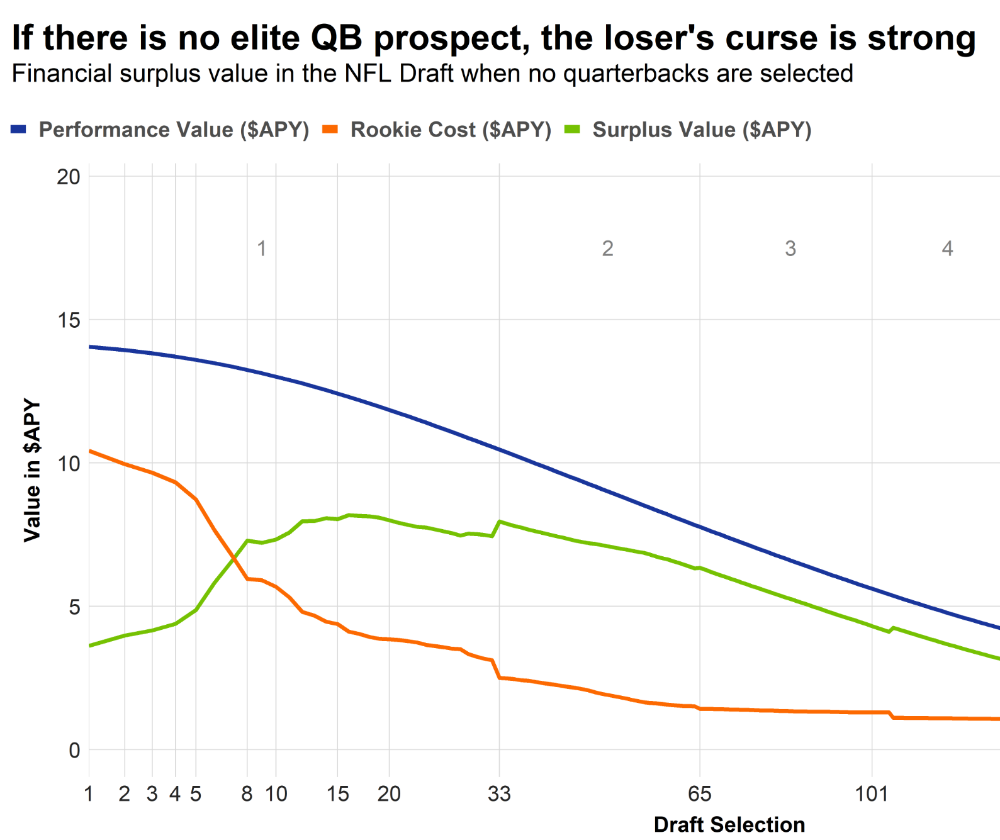

```{r setup, include=FALSE}
knitr::opts_chunk$set(
  echo = TRUE, 
  message = FALSE, 
  warning = FALSE, 
  dpi = 500, 
  fig.width=9, 
  fig.height=5,
  tidy = 'styler'
  )

library(tidyverse)
library(rvest)
library(gt)
library(patchwork)

```

Do we really need another draft values chart out there? No, not really. 

So why does this exist? I haven't seen a draft value chart that satisfies the following two conditions:

1. Is made with publicly available [code and data](https://github.com/nflverse/open-source-football/blob/master/_posts/2023-02-23-nfl-draft-value-chart/nfl-draft-value-chart.Rmd)
2. Shows a draft value curve when excluding quarterbacks

The latter point is especially important. If one combines quarterbacks and non-quarterbacks when constructing a draft value chart, one ends up much too rosy on the value of the top picks in the draft when these picks are not used on a quarterback. [This is due to quarterbacks being very valuable, and quarterbacks selected high in the draft tending to have higher hit rates](https://www.pff.com/news/nfl-why-sprinting-to-the-podium-at-no-2-overall-with-chase-young-on-the-card-might-be-a-bad-idea).

The goal here is to construct a transparent (i.e., the code and methodology are public) and useful draft chart. Like the [Fitzgerald-Spielberger (OTC) NFL Draft Trade Value Chart](https://overthecap.com/draft-trade-value-chart), we're going to use second contracts as a measure of player value. There are some obvious limitations to this:

* We assume that a player's value on the first 4 years of his rookie contract is well represented by what he is able to earn on his 2nd deal. For players who improved a lot at the end of their rookie deals (or suffered serious injury), the measure is far from perfect
* We aren't capturing the value provided by 5th year option for 1st round picks. This somewhat underestimates 1st round pick value, but with the [new fifth-round option values introduced in the 2020 CBA](https://overthecap.com/fifth-year-option-projections), this option isn't as valuable as it used to be. For example, CeeDee Lamb would make about $18 million in his option year due to making one Pro Bowl and Justin Jefferson $20 million due to making multiple Pro Bowls. This isn't typically what we think of when thinking about rookie deal prices
* We aren't capturing the value of being able to re-sign a player before he hits the open market

As mentioned above, we're only going to do this for non-QBs. The value of QBs is so different than every other position that they should be considered separately in any draft analysis.

Before moving forward, a thank you to the invaluable resource that [Over The Cap](https://overthecap.com/) represents. All of the contract data used in this post is taken from their website and this analysis wouldn't be possible without their hard work.

**Updated on February 27, 2023**: (a) added more picks to the table at the bottom so it now displays picks 1-256, (b) added on-field value to table at the bottom, and (c) re-scaled surplus value so it's 0-to-100 (thank you to Luckym4n_ [for the suggestion](https://twitter.com/Luckym4n_/status/1629595953261838336))/

**Updated on April 11, 2023**: Add 2018 draft class to on-field value calculations. Now covers 2011 through 2018. For Calvin Ridley, assume he'll get an extension equivalent to tag value. In addition, use archieved version of Sportrac rookie contract value to avoid site updates breaking the scrape.

**Updated on April 17, 2023**: Added position-specific draft curves.

# Part 1: Make a surplus value curve

In order to calculate the surplus value of each pick. We need two pieces of information. First, how much each pick costs (the contract); and second, how much benefit each pick provides (on-field performance).

## How expensive is each draft pick's rookie deal?

The first thing we need is the actual cost of each draft pick's contract. Some googling led me to [this page](https://www.spotrac.com/nfl/draft/). 

```{r, echo = FALSE}
  url <- "https://web.archive.org/web/20230324102438/https://www.spotrac.com/nfl/draft/"
  page <- read_html(url) %>%
    html_table()

  # count rounts
  r <- 0
  
  t <- map_df(1:length(page), ~{
    
    item <- page[[.x]]
    
    if (nrow(item) > 5) {
      
      r <<- r + 1
      
    item %>%
      janitor::clean_names() %>%
      dplyr::slice(-1) %>%
      # hack for getting 2nd to last column when needed
      dplyr::select(c(1, 7, (ncol(item) - 2))) %>%
      set_names(c("pick", "value", "value2")) %>%
      mutate(value = ifelse(value == "", value2, value)) %>%
      # lol dolphins forfeited their pick
      filter(value != "-") %>%
      mutate(
        pick = stringr::str_remove(pick, "\\s\\(Comp\\)"),
        pick = as.integer(pick),
        # for some reason as.numeric doesn't work so have to do this insane thing
        value = stringr::str_remove(value, "\\$"),
        v1 = stringr::str_extract(value, "[:digit:]*(?=\\,)") %>% as.integer(),
        v2 = stringr::str_extract(value, "(?<=\\,)[:digit:]*(?=\\,)") %>% as.integer(),
        v3 = stringr::str_extract(value, "(?<=\\,)[:digit:]*$") %>% as.integer(),
        # thousands per year avg
        val = (1000000 * v1 + 1000 * v2 + v3) / 4000
      ) %>%
      select(pick, value, val) %>%
        mutate(round = r)
    }
    
  }) %>%
    # fix dolphins missing pick
    mutate(
      pick = ifelse(pick > 20, pick + 1, pick)
    )
  
  # average cap over next 4 seasons (in thousands of $)
    cap_2023 <- 224800000
    cap_tot <- (cap_2023 + cap_2023 * 1.07 + cap_2023 * (1.07^2) + cap_2023 * (1.07^3)) / 4000
    
  # get APY % of cap by draft position
    contracts <- t %>%
      mutate(
        # fill in the random missing picks
        row = (1 : n()) + 1,
        pick = ifelse(is.na(pick), row, pick),
        # calculate % of cap by dividing by average cap over next 4 seasons
        contract_cap_pct = val / cap_tot
      ) %>%
      select(draft_overall = pick, contract_cap_pct) 
    
  # save so don't have to re-scrape if things break later
    # write_csv(contracts, "contracts.csv")
    # contracts <- read_csv("contracts.csv")

```

A couple notes on the calculations we're be using (if you want to see the code, scroll down to the bottom of this post and click the "View source code on GitHub" button, or just [click here](https://github.com/nflverse/open-source-football/blob/master/_posts/2023-02-23-nfl-draft-value-chart/nfl-draft-value-chart.Rmd)). First, we're assuming cap growth rate of 7% over the next 3 seasons (i.e., 2024, 2025, and 2026) before converting the total amount of the rookie deal into a percentage of the cap. For example, the 2023 cap is about $225 million, while the average of the 2023 through 2026 caps is about $250 million using this procedure. Taking the Bears' No. 1 pick for example, we have total value of about $41 million, which is about $10.2 million per season, or 10.2/250 = 4.1 percent of the cap. If we assumed no growth in the salary cap rates, then we would divide 10.2 by 225 which is about 4.5 percent of the cap. In other words, we'd be counting the high draft picks as too expensive.

## How productive has each pick been?

This is pretty simple: take the APY in terms of percent of the cap for each drafted player's second deal (i.e., first deal after rookie contract). For players that did not receive a second contract, we'll assign them a value of zero. We then smooth these values to get a smooth relationship between pick number and on-field performance.

```{r, echo = FALSE}

    players <- nflreadr::load_contracts() %>%
      filter(between(draft_year, 2011, 2018)) %>%
      arrange(otc_id, year_signed) %>%
      group_by(otc_id) %>% 
      dplyr::slice(1:2) %>%
      mutate(
        contracts = n(), row = 1 : n()
        ) %>%
      select(player, otc_id, position, team, draft_year, year_signed, years, value, apy, apy_cap_pct, draft_overall, contracts, row) %>%
      filter(
        !is.na(draft_overall),        # was drafted
        position != "QB",             # is not a QB
        contracts == 1 | row == 2     # either only got drafted (no 2nd contract) or 2nd contract
      ) %>%
      ungroup() %>%
      arrange(draft_year, draft_overall) %>%
      mutate(
        # fill in 0 for guys who didn't get 2nd contract
        apy_cap_pct = ifelse(contracts == 1, 0, apy_cap_pct),
        # Calvin Ridley got a year added to his rookie deal for...reasons
        # Let's assume he'll get something like the tag value
        apy_cap_pct = ifelse(player == "Calvin Ridley", (19.7/224.8), apy_cap_pct),
        # make some buckets for positions
        pos = case_when(
          position %in% c("C", "RG", "LG") ~ "IOL",
          position %in% c("RB", "FB") ~ "RB/FB",
          position %in% c("LT", "RT") ~ "OT",
          TRUE ~ position
        ),
        side = ifelse(
          pos %in% c("IOL", "RB/FB", "OT", "TE", "WR"), "Offense", "Defense"
        ),
        # overall fit
        fit = loess(apy_cap_pct ~ draft_overall)$fitted
      ) %>%
    group_by(pos) %>%
    # positional fit
    mutate(pos_fit = 100 * loess(apy_cap_pct ~ draft_overall)$fitted) %>%
    ungroup()
    
  # combine the data: all positions
    picks <- players %>%
      group_by(draft_overall) %>%
      slice_head(n = 1)
  
  data <- picks %>%
    full_join(contracts, by = "draft_overall") %>%
    ungroup() %>%
    mutate(
      contract_cap_pct = ifelse(
        draft_overall %in% c(21) & is.na(contract_cap_pct), (lead(contract_cap_pct) + lag(contract_cap_pct))/2, contract_cap_pct
      ),
      surplus = fit - contract_cap_pct
    ) %>%
    select(draft_overall, fit, surplus, contract_cap_pct) %>%
    pivot_longer(2:4) %>%
    # convert to % of cap
    mutate(value = value * 100) %>%
    filter(draft_overall <= 256)
  
  # contract for picks 1-256
    cleaned_contract <- data %>% 
      filter(name == "contract_cap_pct") %>%
      select(draft_overall, contract_cap_pct = value)
  
  # combine the data: by position
    picks_pos <- players %>%
      group_by(draft_overall, pos) %>%
      slice_head(n = 1) %>%
      left_join(cleaned_contract, by = "draft_overall") %>%
      ungroup() %>%
      # mutate(pos_surplus = pos_fit - contract_cap_pct) %>%
      mutate(pos_surplus = pos_fit) %>%
      select(draft_overall, pos, side, pos_surplus)
```

# Part 2: Show the draft curves

We first plot our own draft curves and then afterwards compare to others.

## On-field value versus surplus value

Using cost and on-field performance, we can now construct a surplus value curve:

```{r, layout="l-page", dpi = 400, preview=TRUE, echo = FALSE}

  data %>%
    filter(draft_overall <= 100) %>%
    ggplot(aes(draft_overall, value, color = name)) +
    geom_hline(yintercept = 0) +
    geom_line(linewidth = 1) +
    geom_point(size = 3) +
    labs(
      title = "The value of (non-QB) draft picks",
      x = "Draft Pick",
      y = "Value in % of salary cap",
      color = ""
    ) +
    scale_x_continuous(breaks = c(1, 10, 32, 64, 100), expand = c(.01, .01)) +
    scale_y_continuous(breaks = scales::pretty_breaks(n = 5), expand = c(0, 0.05)) +
    ggthemes::theme_fivethirtyeight() +
    theme(
      plot.title = element_text(size = 20, hjust = 0.5),
      plot.subtitle = element_text(size = 12, hjust = 0.5),
      axis.text.x=element_text(hjust=0.5),
      axis.title.x = element_text(size=12, face="bold"),
      axis.title.y = element_text(size=12, face="bold"),
      legend.position=c(.8,.8),
      legend.direction = "vertical",
      legend.text = element_text(size = 20),
      legend.background = element_rect(fill = alpha("white", 0))
    ) +
    scale_color_manual(
      values=c("#d95f02", "#7570b3", "#1b9e77"), 
      labels = c("Contract cost", "On-field value", "Surplus value")
      )
  
```

How to read the chart: the first pick in the draft costs 4.1% of the salary cap (orange line). The on-field production is expected to be 6.4% of the salary cap (purple line). Thus, the surplus value associated with the first pick in the draft is 2.3% of the salary cap (green line).

We have re-produced the now-familiar result that for teams not drafting a quarterback, the surplus value of the very top picks is lower than later in the first round and even throughout most of the second round. This is because the dropoff in salary that teams have to pay to draft picks (orange line) is steeper than the dropoff in on-field value (purple line). This reflects the fact that teams are not very good at identifying the best players in the draft. We have [a lot of evidence that this is the case](https://www.pff.com/news/draft-surplus-value-of-each-position-in-the-nfl-draft). 

This pattern of later first round picks having higher surplus value than early first round picks was originally referred to as the loser's curse in the [seminal paper by Cade Massey and Richard Thaler](https://www.semanticscholar.org/paper/The-Loser%27s-Curse%3A-Decision-Making-and-Market-in-Massey-Thaler/61bbf4dd4aeb2e915f631832dc890f92a9a0c12c?p2df). Massey and Thaler wrote their paper during the pre-2011 CBA when rookie contracts were a lot more expensive; however, the pattern still holds up now. In addition, we have replicated earlier findings by [PFF's Timo Riske](https://www.pff.com/news/draft-surplus-value-of-each-position-in-the-nfl-draft) using a similar approach that took advantage of player contract data and yet another study [by Riske](https://www.pff.com/news/nfl-revisiting-the-losers-curse-the-surplus-value-of-draft-picks) that used PFF Wins Above Replacement (WAR).

In particular, our chart above looks remarkably similar to this picture below from [Timo's work](https://www.pff.com/news/draft-surplus-value-of-each-position-in-the-nfl-draft), which is always a good sign that we're on the right track:



## Comparison with other draft curves

The three draft charts that I tend to see the most often are the [OTC chart](https://overthecap.com/draft-trade-value-chart), the [PFR chart](https://www.footballperspective.com/draft-value-chart/) made by Chase Stuart based on AV, and the original Jimmy Johnson chart. Here's how they compare with the surplus and on-field values shown above. 

In the figure below, we scale each draft curve so that the value of the first overall pick represents 100 draft points.

```{r, echo = FALSE}
 raw_otc <- read_html("https://overthecap.com/draft-trade-value-chart") %>%
    html_table() %>%
    pluck(1) %>%
    janitor::clean_names() 

  # what peak coding performance looks like
  otc <- bind_rows(
    raw_otc %>% select(pick, value),
    raw_otc %>% select(pick = pick_2, value = value_2),
    raw_otc %>% select(pick = pick_3, value = value_3),
    raw_otc %>% select(pick = pick_4, value = value_4)
  ) %>%
    select(draft_overall = pick, otc_value = value) %>%
    mutate(otc_value = otc_value / dplyr::first(otc_value))
  
  raw_pfr <- read_html("https://www.footballperspective.com/draft-value-chart/") %>%
    html_table() %>%
    pluck(1) %>%
    janitor::clean_names() %>%
    select(draft_overall = pk, av_val) %>%
    mutate(av_val = av_val / dplyr::first(av_val))

  raw_jj <- read_html("https://www.drafttek.com/NFL-Trade-Value-Chart.asp") %>%
    html_table() %>%
    pluck(2) %>%
    janitor::clean_names() %>%
    select(x2, x4, x6) %>%
    filter(!is.na(x6))

  jj <- bind_rows(
    raw_jj %>% select(value = x2) %>% filter(!is.na(value)),
    raw_jj %>% select(value = x4) %>% filter(!is.na(value)),
    raw_jj %>% select(value = x6) %>% filter(!is.na(value))
  ) %>%
    mutate(draft_overall = 1 : n()) %>%
    mutate(jj_value = value / dplyr::first(value)) %>%
    select(-value)
  
  df <- data %>%
    filter(name %in% c("surplus", "fit")) %>%
    group_by(draft_overall, name) %>%
    slice_head(n = 1) %>%
    ungroup() %>%
    pivot_wider(names_from = "name", values_from = "value") %>%
    mutate(
      osf_surplus = surplus / max(surplus),
      osf_fit = fit / dplyr::first(fit)
      ) %>%
    left_join(otc, by = "draft_overall") %>%
    left_join(raw_pfr, by = "draft_overall") %>%
    left_join(jj, by = "draft_overall") %>%
    pivot_longer(2:8) %>%
    arrange(draft_overall, name)
  
```

```{r, layout="l-page", dpi = 400, echo = FALSE}

  plot_df <- df %>%
    mutate(value = value * 100) %>%
    filter(draft_overall <= 100, !name %in% c("fit", "surplus"))

  plot_df %>%
    ggplot(aes(draft_overall, value, color = name)) +
    geom_hline(yintercept = 0) +
    geom_line(linewidth = 1) +
    geom_point(size = 3) +
    labs(
      title = "Draft chart comparison",
      x = "Draft Pick",
      y = "Pct diff in value vs to No. 1 pick",
      color = ""
    ) +
    scale_x_continuous(breaks = c(1, 10, 32, 64, 100), expand = c(.01, .01)) +
    scale_y_continuous(breaks = scales::pretty_breaks(n = 5), expand = c(.05, 0.55)) +
    ggthemes::theme_fivethirtyeight() +
    theme(
      plot.title = element_text(size = 20, hjust = 0.5),
      plot.subtitle = element_text(size = 12, hjust = 0.5),
      axis.text.x=element_text(hjust=0.5),
      axis.title.x = element_text(size=12, face="bold"),
      axis.title.y = element_text(size=12, face="bold"),
      legend.position=c(.6,.95),
      # legend.direction = "vertical",
      legend.text = element_text(size = 16),
      legend.background = element_rect(fill = alpha("white", 0))
    ) +
    scale_color_manual(
      values=c("#1b9e77", "#d95f02", "#7570b3", "#e7298a", "#66a61e"), 
      labels = c("PFR", "JJ", "BB (on-field)", "BB (surplus)", "OTC")
      )
```

Because our surplus value chart doesn't have the first pick as the most valuable pick, unsurprisingly, it looks very different than the other charts. Interestingly, the player value curve (i.e., on-field value of player without accounting for cost of rookie contract) is still flatter than the other three curves. This shouldn't come as a surprise given that we have excluded quarterbacks and the other charts do not.

Unsurprisingly, draft charts tend to overvalue the top picks in the case when these picks are not used on a quarterback. This adds to the mountain of evidence discussed above that NFL teams largely do not understand the relative values of draft picks and are dramatically overconfident in their ability to pick the right players at the top of the draft. The original Jimmy Johnson chart, for example, comes nowhere close to reflecting the true value of picks.

## Draft Value by Position

Inspired by [Kevin Cole's post here](https://unexpectedpoints.substack.com/p/what-analytical-draft-value-curves), we can also compute position-specific curves. Let's show on-field value rather than surplus value because surplus value is computed using costs that are invariant to position. That is, to go from one to the other, we would subtract the pick-specific cost from each curve.

```{r, layout="l-page", dpi = 400, echo = FALSE}

def <- picks_pos %>%
  filter(side == "Defense") %>%
  filter(draft_overall <= 120, !pos %in% c("K", "P", "LS")) %>%
  ggplot(aes(draft_overall, pos_surplus, color = pos)) +
  geom_hline(yintercept = 0) +
  geom_smooth(size = 2, se = FALSE) + 
  labs(
    title = "Defense",
    x = "Draft Pick",
    y = "Value in % of salary cap",
    color = ""
  ) +
  scale_x_continuous(breaks = c(1, 10, 32, 64, 100), expand = c(.01, .01), limits = c(0, 96)) +
  scale_y_continuous(breaks = scales::pretty_breaks(n = 10), expand = c(0, 0.05)) +
  ggthemes::theme_fivethirtyeight() +
  theme(
    plot.title = element_text(size = 18, hjust = 0.5),
    axis.text.x=element_text(hjust=0.5),
    axis.title.x = element_text(size=12, face="bold"),
    axis.title.y = element_text(size=12, face="bold"),
    legend.position=c(.8,.8),
    legend.direction = "vertical",
    legend.text = element_text(size = 24),
    legend.background = element_rect(fill = alpha("white", 0))
  ) +
  scale_color_manual(values=c(
    "#e41a1c", 
    "#377eb8", 
    "#4daf4a",
    "#984ea3",
    "#ff7f00"
  )
  )

off <- picks_pos %>%
  filter(side == "Offense") %>%
  filter(draft_overall <= 120, !pos %in% c("K", "P", "LS")) %>%
  ggplot(aes(draft_overall, pos_surplus, color = pos)) +
  geom_hline(yintercept = 0) +
  geom_smooth(size = 2, se = FALSE) + 
  labs(
    title = "Offense",
    x = "Draft Pick",
    y = "Value in % of salary cap",
    color = ""
  ) +
  scale_x_continuous(breaks = c(1, 10, 32, 64, 100), expand = c(.01, .01), limits = c(0, 96)) +
  scale_y_continuous(breaks = scales::pretty_breaks(n = 10), expand = c(0, 0.05)) +
  ggthemes::theme_fivethirtyeight() +
  theme(
    plot.title = element_text(size = 18, hjust = 0.5),
    axis.text.x=element_text(hjust=0.5),
    axis.title.x = element_text(size=12, face="bold"),
    axis.title.y = element_text(size=12, face="bold"),
    legend.position=c(.8,.8),
    legend.direction = "vertical",
    legend.text = element_text(size = 24),
    legend.background = element_rect(fill = alpha("white", 0))
  ) +
  scale_color_manual(values=c(
    "#e41a1c", 
    "#377eb8", 
    "#4daf4a",
    "#984ea3",
    "#ff7f00"
  )
  )


off + def &
  ggthemes::theme_fivethirtyeight() & 
  theme(
    plot.title = element_text(size = 18, hjust = 0.5),
    axis.text.x=element_text(hjust=0.5),
    axis.title.x = element_text(size=12, face="bold"),
    axis.title.y = element_text(size=12, face="bold"),
    legend.position=c(.8,.8),
    legend.direction = "vertical",
    legend.text = element_text(size = 12),
    legend.background = element_rect(fill = alpha("white", 0))
  ) &
  scale_y_continuous(limits = c(0, 8), expand = c(0, 0.05), breaks = scales::pretty_breaks(n = 10)) &
  plot_annotation(
    title = 'The Value of (non-QB) Draft Picks',
    subtitle = 'Draft Curves from 2011-2018 Draft Classes',
    caption = '@benbbaldwin',
    theme = theme(
      plot.title = element_text(size = 18, hjust = 0.5, face="bold"),
      plot.subtitle = element_text(size = 14, hjust = 0.5)
      )
  )
  
```

Looking at the results, we see that RB (offense) and Safety (defense) are the low positions on the totem pole. At the top, the highest returns have been for pass rushers (both edge and inside) and offensive tackles.

# Part 3: Some example calculations

At the bottom of this post, I will leave a table that contains the same information presented in two ways. First, an estimated value of each pick on a familiar scale that is primarily useful for calculating trades involving draft picks only. In addition, the table contains the actual estimate of APY per year (over 4 years) in order to facilitate evaluations of pick-for-player trades. In this section, I will provide an example of both. Remember that this is for non-QBs: if a quarterback is involved, don't use this table.

Finally, the table also presents draft values using on-field value only (i.e., the purple curve above) for comparison.

## Draft day trade: example 1

Let's start with last year's controversial Lions-Vikings trade, in which the Vikings [were panned](https://www.sbnation.com/2022/4/29/23048475/vikings-lions-trade-nfl-draft-jameson-williams-lewis-cine) for the lack of return they got for moving back 20 picks in the first round.

Here's the trade with the estimated values obtained from this post (again, the full table is displayed below):

* Lions receive: No. 12 (100), No. 46 (73). Total: 173
* Vikings receive: No. 32 (82), No. 34 (86), No. 66 (55). Total: 223
* Difference: 50, which is the value of **pick No. 72**

So the surplus value the Vikings obtained in this trade was the equivalent of an early third-round pick. Not bad for a trade that popular commentary thought that they lost!

What if we ignored surplus value and just looked at on-field value (i.e., player production ignoring cost)?

* Lions receive: No. 12 (87), No. 46 (54). Total: 141
* Vikings receive: No. 32 (66), No. 34 (64), No. 66 (41). Total: 171
* Difference: 30, which is the value of **pick No. 91**, or a pick towards the end of the 3rd round.

So even if you ignore the cost of players entirely (which is not a good idea in a league with a salary cap), there is no argument against the Vikings winning this trade in terms of the expected value of the picks.

## Draft day trade: example 2

One of the worst draft-day trades I can remember that didn't involve players or future picks was the Jets trading up for Alijah Vera-Tucker in 2021. Let's see how bad it looks using the chart below:

* Jets receive: No. 14 (100), No. 143 (20). Total: 120
* Vikings receive: No. 23 (91), No. 66 (55), No. 86 (41). Total: 187
* Difference: 67, which is more than the value of **pick No. 3** (which is the same as the surplus value of pick 53)

Being extremely generous to the Jets, we could say they gave up the surplus value of a 2nd round pick to move up for a guard. Alternatively, we could say they gave up the surplus value of the No. 3 pick!

## Player for picks trade

This is somewhat complicated since some of the picks were in the future. Let's be generous to the Seahawks and discount the 2022 picks by 10 percent. We will now use the APY version of the table in order to calculate the total cost of the Adams trade and extension:

* Seahawks receive: 2022 pick 109 (1.11 * .9)
* Jets receive: 2021 pick 23 (3.28), 2021 pick 86 (1.50), 2022 pick 10 (3.42 * .9)
* Difference: 3.28 + 1.50 + (3.42 * .9) - (1.11 * .9) = **6.9 percent of the salary cap** per year over 4 years

So we have arrived at 6.9% of the salary cap in APY per year over 4 years as the value of picks given up for the Seahawks. Adams' 4-year deal extension with the Seahawks was $17.5 APY, or 9.6% of the salary cap at the time, per OTC. Dividing 6.9% (draft surplus given up) by 9.6% (contract APY), we need to inflate Adams' APY by 72%, arriving at a true contract cost of, **30.1 million dollars per year over 4 years**.

This is the same ballpark that Bill Barnwell landed on in his [review of the trade](https://www.espn.com/nfl/story/_/id/29538280/jamal-adams-trade-grades-seahawks-jets-safety-really-worth-much), which was written before the extension was signed. Barnwell assumed an extension of $16 million APY:

> "Factor in the cost of acquiring Adams and that four-year, $64 million extension suddenly becomes a four-year, $108.5 million contract. Instead of paying Adams $16 million per year, now he has cost the Seahawks more than $27 million per season, which is more than anybody in the league who isn't a quarterback. If their picks end up being juicier than they were expecting, that price goes up. Adams has to be the best non-quarterback in the league to make the math work."

Combine the Seahawks being worse than expected over this time period with Adams getting a somewhat larger deal than expected, and the estimates of the true cost of the trade and extension for Adams are remarkably consistent between Barnwell's piece and this methodology.

And hopefully now one can understand how surplus value calculations are formed.

# Part 4: The full table

Here's the full table:

```{r, echo = FALSE}

table_data <- df %>%
  filter(name %in% c("osf_surplus", "surplus", "osf_fit"), !is.na(value)) %>%
  pivot_wider(names_from = "name", values_from = "value") %>%
  mutate(
    osf_surplus = (100 * osf_surplus) %>% round(0),
    osf_fit = (100 * osf_fit) %>% round(0),
    surplus = round(surplus, 2)
    ) %>%
  select(draft_overall, osf_surplus, surplus, osf_fit)

t1 <- table_data[1:64,]
t2 <- table_data[65:128,]
t3 <- table_data[129:192,]
t4 <- table_data[193:256,]

table <- bind_cols(t1, t2, t3, t4) %>%
  gt::gt()  %>% 
  cols_label(
    draft_overall...1 = "Pick", draft_overall...5 = "Pick", draft_overall...9 = "Pick", draft_overall...13 = "Pick",
    osf_surplus...2 = "Points", osf_surplus...6 = "Points", osf_surplus...10 = "Points", osf_surplus...14 = "Points",
    surplus...3 = "APY", surplus...7 = "APY", surplus...11 = "APY", surplus...15 = "APY",
    osf_fit...4 = "OFV", osf_fit...8 = "OFV", osf_fit...12 = "OFV", osf_fit...16 = "OFV"
  ) %>% 
  gtExtras::gt_theme_espn() %>%
  gtExtras::gt_color_rows(
    columns = c(2, 6, 10, 14),
    domain = c(1, 100),
    palette = "ggsci::red_material"
    ) %>%
  gt::tab_header(title = "BB Draft Value Chart") %>%
  gt::tab_source_note(gt::md(glue::glue('**Notes**: @benbbaldwin | {lubridate::today()}'))) %>%
  tab_options(
    table.font.size = px(16L),
    data_row.padding = px(2)
  ) %>%
  tab_style(
    style = list(
      cell_text(weight = "bold")
    ),
    locations = cells_body(
      columns = c(1, 5, 9, 13)
    )
  ) %>%
  tab_style(
    style = list(
      cell_borders(
        side = c("left"), 
        color = "black",
        weight = px(2)
      )
    ),
    locations = cells_body(
      columns = c(5, 9, 13)
    )
  ) %>%
    tab_footnote(
    footnote = "Surplus value: draft value points",
    locations = cells_column_labels(
      columns = c(2, 6, 10, 14)
    )
  ) %>%
    tab_footnote(
    footnote = "Surplus value: APY as percent of salary cap",
    locations = cells_column_labels(
      columns = c(3, 7, 11, 15)
    )
  ) %>%
    tab_footnote(
    footnote = "On-Field Value: draft value points IGNORING SALARY COST",
    locations = cells_column_labels(
      columns = c(4, 8, 12, 16)
    )
  )

table  
```

Here is [a link to a .csv of the table](https://github.com/nflverse/open-source-football/tree/master/_posts/2023-02-23-nfl-draft-value-chart/osf_draft_chart.csv).

```{r, echo = FALSE}
table_data %>%
  write_csv("osf_draft_chart.csv")
```


<!-- ####################################################################### -->
<!-- Place at end of document 
Please keep this chunk as is at end of your document. 
It will create a hyperlink to the source file. -->

```{r gh-source, results='asis', echo=FALSE}
'%>%' <- magrittr::`%>%`
fld <- fs::path_wd() %>% fs::path_split() %>% purrr::pluck(1) %>% tibble::as_tibble() %>% dplyr::slice_tail(n = 1)
fn <- fs::path_wd() %>% fs::dir_ls() %>% fs::path_filter("*.Rmd") %>% fs::path_rel()
glue::glue('<a href="https://github.com/nflverse/open-source-football/blob/master/_posts/{fld}/{fn}"
               style="font-family:Consolas;color:blue;background-color:#f8f8f8;align:right;font-size:75%;"
              >View source code on GitHub
           </a>'
)
```

<!-- ####################################################################### -->
